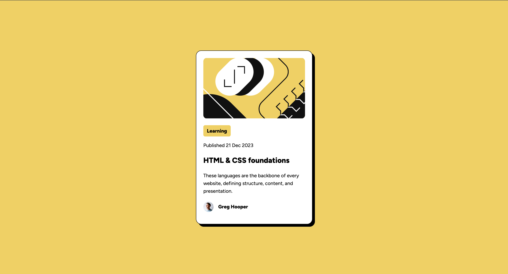

# Frontend Mentor - Blog preview card solution

This is a solution to the [Blog preview card challenge on Frontend Mentor](https://www.frontendmentor.io/challenges/blog-preview-card-ckPaj01IcS). Frontend Mentor challenges help you improve your coding skills by building realistic projects.

## Table of contents

- [Overview](#overview)
  - [The challenge](#the-challenge)
  - [Screenshot](#screenshot)
  - [Links](#links)
- [My process](#my-process)
  - [Built with](#built-with)
  - [Execution](#execution)
  - [Notes From Feedback](#notes-from-feedback)
- [Author](#author)

## Overview

### The challenge

Users should be able to:

- See hover and focus states for all interactive elements on the page

### Screenshot

## My process

- Solution with existing knowledge, use google search only when needed.
- Spend some time to optimize the solution and approach.

### Built with

- Semantic HTML5 markup
- CSS custom properties
- CSS Grid

### Execution

I tried to make it responsive as much as possible. While completing this challenge I learned more about following property.

- box-shadow
- when and how to use !important
- max-width and max-height
- how to scale image size using transform property.
- vertical-align

### Notes From Feedback

- User CSS BEM (Block, Elemenet, Modifier), It is a naming convention and methodology used in CSS to create reusable, maintainable, and scalable code.
- Use CSS reset template , [Josh Comeau Modern CSS Reset](https://www.joshwcomeau.com/css/custom-css-reset/)
- Transform CSS property is used more for automation.
- Avoid using `!important` declaration.
- User more semantic HTML tags, `<main>, <footer>, <section> and <nav> tags`.
- Which unit to choose for font related CSS property. [The Surprising Truth About Pixels and Accessibility](https://www.joshwcomeau.com/css/surprising-truth-about-pixels-and-accessibility/)

## Author

- Frontend Mentor - [@shailesh7333](https://www.frontendmentor.io/profile/shailesh7333)
- Twitter - [@SilentCoder007](https://www.twitter.com/SilentCoder007)
