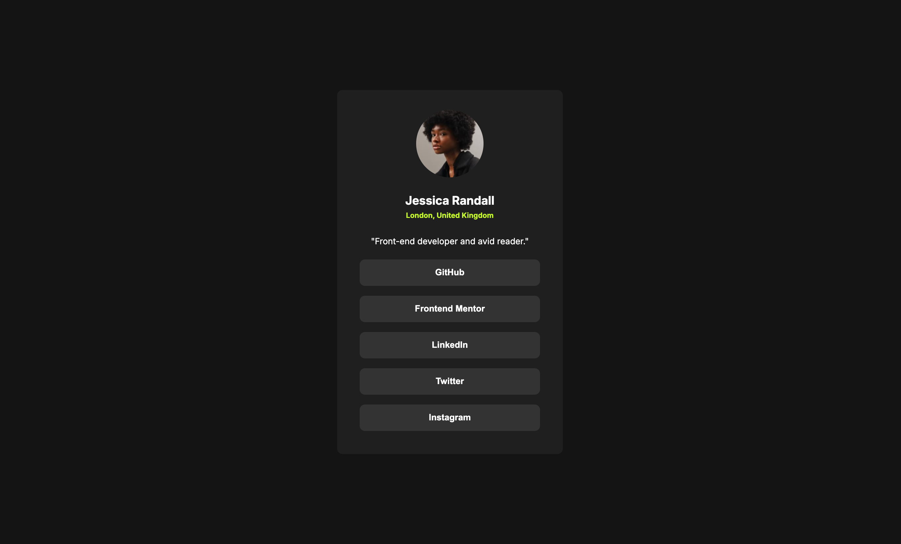

# Frontend Mentor - Social links profile solution

This is a solution to the [Social links profile challenge on Frontend Mentor](https://www.frontendmentor.io/challenges/social-links-profile-UG32l9m6dQ). Frontend Mentor challenges help you improve your coding skills by building realistic projects.

## Table of contents

- [Overview](#overview)
  - [The challenge](#the-challenge)
  - [Screenshot](#screenshot)
  - [Links](#links)
- [My process](#my-process)
  - [Built with](#built-with)
  - [Execution](#execution)
  - [Notes From Feedback](#notes-from-feedback)
- [Author](#author)

## Overview

### The challenge

Users should be able to:

- See hover and focus states for all interactive elements on the page

### Screenshot

### Built with

- Semantic HTML5 markup
- CSS custom properties
- Flexbox
- CSS Grid

### Execution

- With the basic HTML and CSS knowledge this challenge was quite easy. However, initially I struggled to center the content div but eventually I made it worked.
- I learned how to add global variable in CSS and use it anywhere within the CSS file.

### Notes From Feedback

## Author

- Frontend Mentor - [@shailesh7333](https://www.frontendmentor.io/profile/shailesh7333)
- Twitter - [@SilentCoder007](https://www.twitter.com/SilentCoder007)
